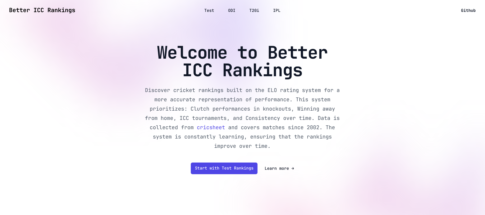
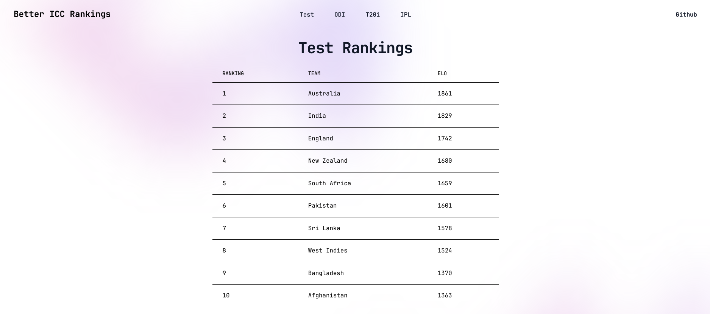

# Better ICC Rankings

Discover cricket rankings built on the ELO rating system for a more accurate representation of performance. This system prioritizes: Clutch performances in knockouts, Winning away from home, ICC tournaments, and Consistency over time. Data is collected from cricsheet and covers matches since 2002. The system is constantly learning, ensuring that the rankings improve over time.

## How it works:

The python program scrapes through all the matches and then calculates elo ratings through different K-factors. The K-factors depend upon: Home/Away, Knockouts, and ICC tournaments. After calculating the elo, it writes the data in ts file which is located in the website directory.

## How to update the ratings:

You can either:

1) Just wait for the matches to update on cricsheet.org and then copy extract the data and run the python program.
2) Maintain the matches.txt file and code the python program to work only from the matches.txt

## Contribution Guidelines

Contributions to this project are welcomed! (the code is very confusing though because i never cleaned it, at that time only me and github copilot knew what was going on and now only github copilot knows) If you have suggestions, feature requests, or bug fixes, please open an issue or submit a pull request.

## License

This project is licensed under the MIT License. You can find the details in the LICENSE file
